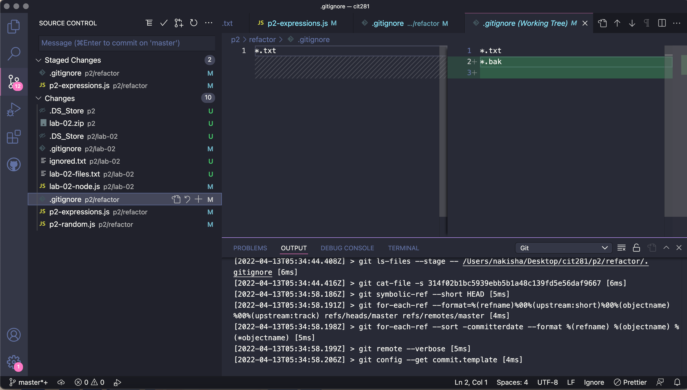

Project 2

This week, we get to learned more about git and CLI commands. We also get to practice refactoring JavaScript code.

We also get to practice writing some functions that outputs a random string. 

